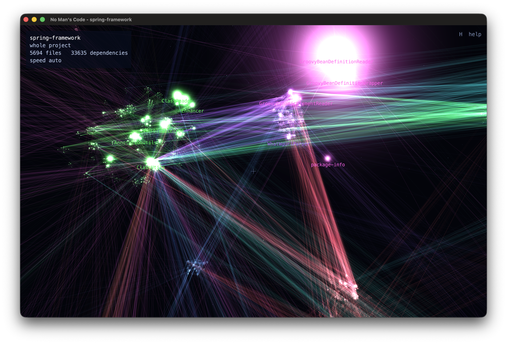
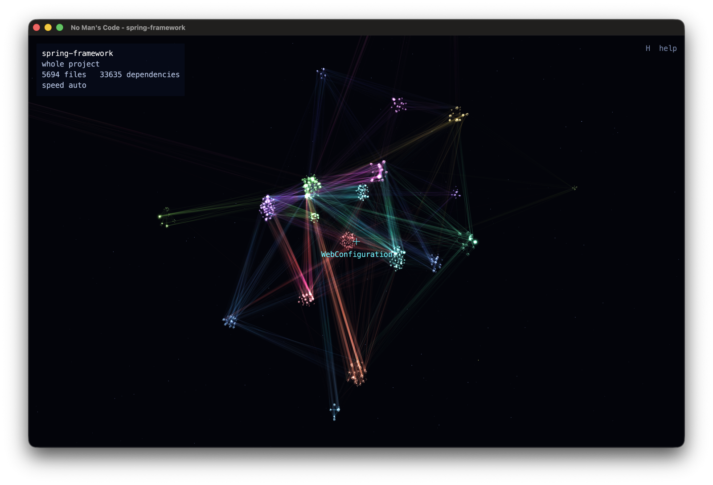
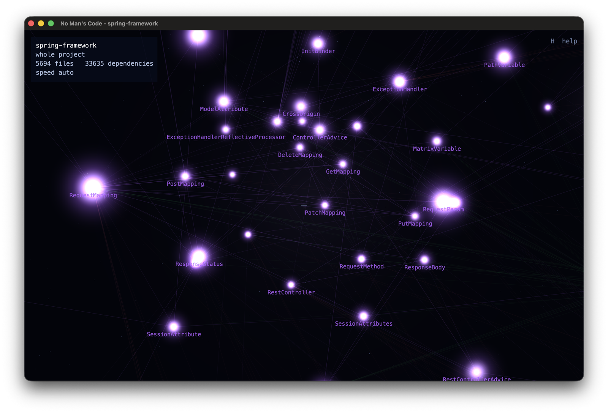
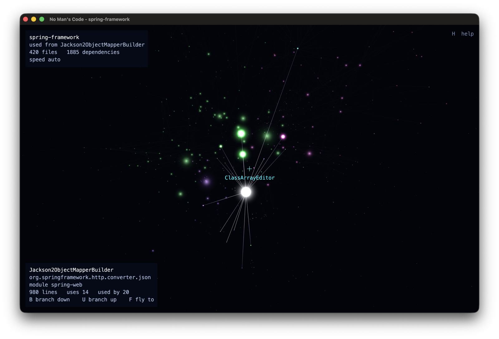

# No Man's Code

Fly through your codebase's dependency graph in 3D. Every source file is a star, every import
a line between two stars, every module its own star cluster, drifting in nebula haze. The
executable is called `depgraph`.

You fly with WASD and the mouse, game style. Click a star for its info; its connections
light up. `B` cuts everything away except what that class uses, `U` the other direction,
`/` searches. Big files are big stars, and the files everyone imports glow.

It clones straight from a GitHub url if you give it one. `--demo` flies the camera around
on its own, a screensaver for your codebase; `--lock` on top locks the screen when someone
interrupts the tour. The whole thing is a single ~7 MB jar that runs on macOS, Windows and
Linux with Java 17 or newer.

All shots show [spring-framework](https://github.com/spring-projects/spring-framework):
the whole project as module galaxies, a package knot up close, and a branch view of
everything one class uses.

|  |  |  |
| --- | --- | --- |

## Run

From a checkout (builds automatically on first run and after source changes):

    ./depgraph                                  # whole project in the current directory
    ./depgraph -p ~/projects/rocket-shop        # a project somewhere else
    ./depgraph https://github.com/square/okio   # clone a repository and fly through it
    ./depgraph CheckoutViewModel                # only what that class uses, downwards
    ./depgraph -m feature-checkout              # one module in isolation
    ./depgraph --package com.acme.billing       # one package subtree in isolation

Repository urls (https or git@) need git installed: the repo is shallow-cloned into the
system temp dir, reused and freshened on the next call, and cleaned away whenever the
operating system clears its temp files.

Class, module and package scopes combine: `-m feature-checkout CheckoutViewModel` branches
from the class inside that module only, and every scope also works with `--demo` and
`--stats`.

## Share it

    ./gradlew fatJar

produces `build/libs/depgraph-all.jar`, a single file that runs on macOS (Intel and Apple
Silicon), Windows and Linux with Java 17 or newer:

    java -jar depgraph-all.jar                        # double-click works too, folder chooser opens
    java -jar depgraph-all.jar -p ~/path/to/project   # whole project
    java -jar depgraph-all.jar -p ~/path MyViewModel  # only what that class uses
    java -jar depgraph-all.jar -p ~/path -u MyClass   # only what uses that class
    java -jar depgraph-all.jar --stats -p ~/path      # terminal stats, no window

On macOS the jar restarts itself with the -XstartOnFirstThread flag GLFW needs, so a plain
`java -jar` works there too. Started without arguments outside a project (a double-clicked
jar, for example), a folder chooser asks which project to explore.

## Options

    -p, --project <x>     project root or a git url to clone (default: current directory)
    -c, --config <x>      language/framework config: android, jvm, python, or your own file
    -m, --module <name>   only files of that module, in isolation
        --package <pre>   only files in that package and below, in isolation
    -d, --depth <n>       how many levels to follow from the class (default: all)
    -u, --up              follow dependents upwards instead of dependencies downwards
    -t, --tests           include test sources
    -s, --stats           print statistics and exit, no window
        --demo            fullscreen self-flying tour, any input quits (screensaver)
        --lock            lock the screen when the window closes; with --demo whoever
                          stops the tour has to unlock
        --adb             follow a connected device's foreground screen and fly to it
    -h, --help            show help

`--demo --lock` is the manual screensaver: start it before walking away, anyone who touches
the machine kills the tour and faces the password prompt. On macOS the lock is the display
going to sleep, so set "Require password after screen saver begins or display is turned off"
to "immediately" in System Settings > Lock Screen. While the tour runs it keeps the display
awake (caffeinate on macOS, systemd-inhibit on Linux), so the system's own idle lock does not
cut it short; if the session locks anyway (lid closed, Cmd-Ctrl-Q, Win+L), the tour ends
itself cleanly. Windows has no keep-awake helper, so there the tour simply ends when the
system locks.

For a one-word start, add an alias to your shell profile (`~/.zshrc` or `~/.bashrc`):

    alias saver='~/code/no-mans-code/depgraph -p ~/projects/rocket-shop --demo --lock'

To call `depgraph` from anywhere, put the checkout on your PATH instead. The launcher finds
its own location, so nothing else is needed:

    export PATH="$HOME/code/no-mans-code:$PATH"

Without `-p` it takes the current directory as the project, so `depgraph --demo --lock`
inside a project is the shortest form. The alias does not need the PATH entry.

## Follow a running app

    ./depgraph -p ~/code/rocket-shop --adb

With `--adb` depgraph watches a connected device over adb and flies to whatever screen is in
the foreground, moving on its own as you drive the app on the device. You keep flying and
looking around the whole time; the camera only takes over again when the screen changes. Pair
it with `-p`. It needs adb on the PATH and one device attached, and cannot be combined with
`-m`, `--package`, a class name or `--demo`.

The foreground activity is matched by its class, read from `dumpsys activity activities`, against
the project's files. The class name is the source name (`com.rob.plantix.MainActivity`), so the
flavor's applicationId (`com.peat.plantix.alpha`) never enters into it, and another app's screen is
ignored because its class is not in the graph. It follows moves between activities; navigation that
only swaps a fragment inside one activity is not tracked. If twenty seconds pass without a single
screen matching a file, the top-left readout says so in red until the first match.

Under `--adb` the star is light-selected (marked without dimming the rest of the graph) and the
camera orbits the screen's package instead of flying in close. Toggle either with `L` and `O`.

## Configs

What counts as a source file, how names and modules are derived, and optionally how the
universe looks all come from a config. Three are built in (`android`, `jvm`, `python`); the
right one is picked automatically from marker files (AndroidManifest.xml, gradle or maven
files, pyproject.toml, ...). Pass `-c` to force one or to use your own:

    java -jar depgraph-all.jar -p ~/code/myservice -c myconfig.conf

A config is a plain text file of `key: value` lines; values are taken verbatim, so regexes
need no escaping. Every key is explained in
[src/main/resources/configs/README.md](src/main/resources/configs/README.md), together with
a walkthrough for adding your own language, and
[template.conf](src/main/resources/configs/template.conf) next to it is the blank form to
copy: every key in one file, the optional ones commented out. The bundled
[jvm](src/main/resources/configs/jvm.conf) and
[python](src/main/resources/configs/python.conf) configs are working examples of the two
package styles, declaration and path.

Look-and-feel keys (`look.*`) are optional in every config: star sizes and growth curve, edge
brightness and fade distance, drift, haze intensities and all cluster spacings. Defaults are
the tuned values, so a config only lists what it changes.

## Controls

    mouse           look around, click the window to start flying
    W A S D         fly
    space / C       rise / descend
    shift           boost
    scroll          flight speed; before the first scroll it adjusts itself,
                    slowing down near stars for a closer look
    click, enter    select the file at the crosshair; into empty space to unselect
    B               branch down, show only what the selection uses
    U               branch up, show only what uses the selection
    [  ]            branch depth
    R               back to the whole project and the overview camera
    F               fly to the selection; right after a search, select its hit
    L               light select: mark the star without dimming the rest
    O               orbit the selection's package instead of flying in close
    /               search classes, files and modules
    tab             labels on / off
    esc             release the mouse
    H               help
    Q               quit

Branching re-lays out the files that are left and animates them into place, so a class and its
dependencies pull apart from the rest of the project instead of staying lost in it.

## What ends up in the graph

Kotlin and Java files under `<module>/src/<sourceSet>/`, skipping test source sets unless you
pass `-t`. Edges come from `import` statements resolved against the project's own types, plus
references between files that share a package. Nothing outside the project is drawn, so
`androidx`, `dagger` and friends never clutter the view.

A file's size is its amount of code, so god classes loom like giants. Its glow is how many
other files import it, so the core types of the project burn brightest. Colour is the Gradle
module. Dependency lines fade with distance: you see the wiring around you, and more of it
lights up as you fly towards a cluster. A selection's lines ignore the fade and stay lit
across all of space.

## Where it is approximate

Imports are read with regular expressions, not a compiler, which is fast and good enough to
navigate by but not exact:

- One node per file. A file declaring several types is a single star named after the file.
- Same-package references are matched by name, so a file naming a sibling type inside a comment
  or a string gets an edge it has not earned.
- Wildcard imports link to every type in that package.
- Types reached only through generics or reflection are missed.

## Building

The Gradle wrapper is included; building needs a JDK 17 or newer. `./gradlew installDist`
builds the launcher the `depgraph` script uses, `./gradlew fatJar` the shareable jar.

## License

[MIT](LICENSE)
